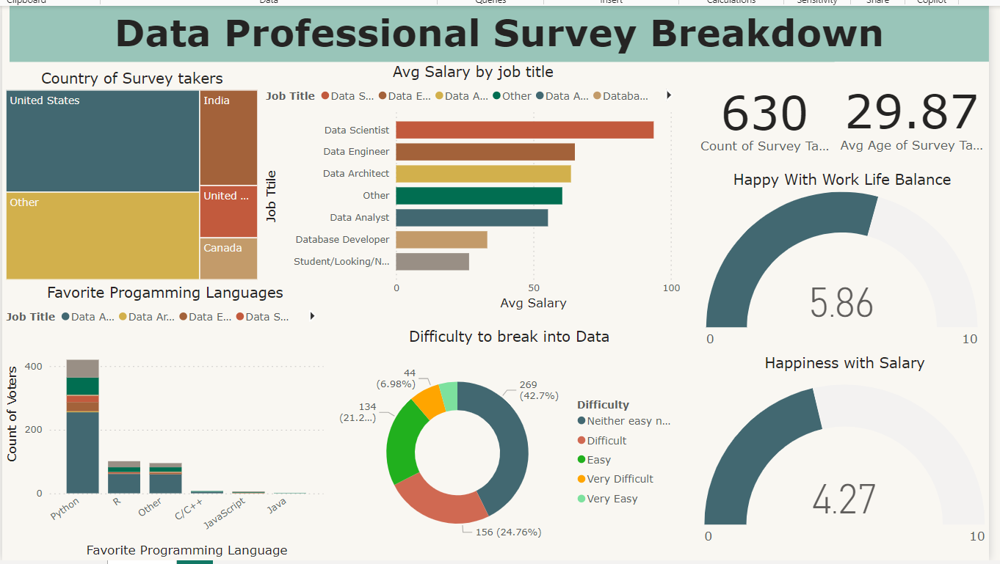

# Surveying Career Transitions: Exploring Data Professional Perspectives

In this project, I conduct a comprehensive survey aimed at understanding the career trajectories and satisfaction levels of individuals in the field of data. Through a series of meticulously crafted questions, I delve into various aspects including career transitions, salary satisfaction, industry preferences, programming language preferences, job satisfaction metrics, and key considerations in job searches.

The survey encompasses a wide range of topics, from demographic information such as age, gender, country of residence, and ethnicity to career-specific inquiries like previous career switches into data, current job roles, and industries worked in. Additionally, I explore respondents' happiness levels across different facets of their current positions, including salary, work/life balance, coworker relationships, management satisfaction, upward mobility, and opportunities for learning.

Through this project, I aim to gain valuable insights into the challenges and opportunities encountered by individuals pursuing careers in data-related fields. By analyzing survey responses, I seek to identify trends, correlations, and areas of concern within the data professional community. Ultimately, the findings of this survey will contribute to a deeper understanding of the landscape of data careers and inform strategies for career advancement, job satisfaction, and talent acquisition in the data industry.

